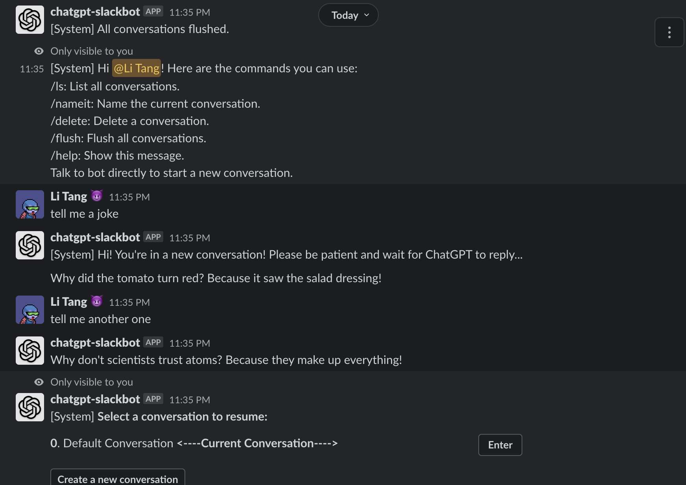
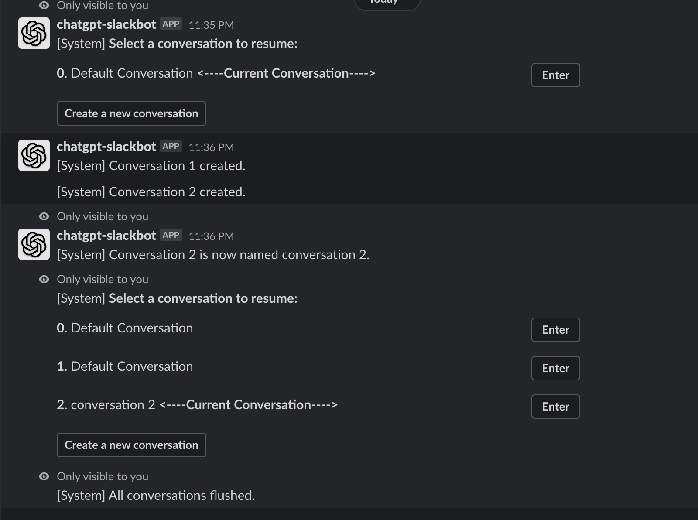
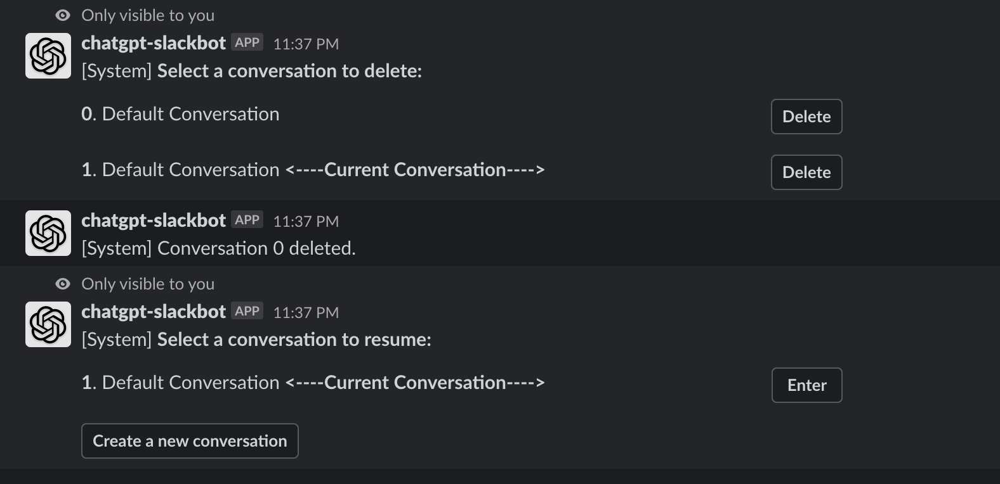

# chatgpt-slack

This project means to build a bot in slack ecosystem, interats with slack users and behalf like an tutor. 

## Steps

1. Create a slack bot
2. Configure this bot like scopes, turn on socket mode(A little complicated, please refer to Slack Developer Docs)
3. Install bot to your workspace, find bot_token, signing_secret and app_token
4. create an openai account and generate an api_key(refer to openAI docs)
5. run this program and try to dm the bot with `/help`
6. enjoy this bot

## ENV should be feeded for this program:

`OPENAI_API_KEY`: your api key from openai

`SLACK_BOT_TOKEN`: bot token

`SLACK_SIGNING_SECRET`: bot signing key

`SLACK_APP_TOKEN`: bot app token, only available after socket mode is enabled

`REDIS_URL`: redis url, used for persistence

`SENTRY_DSN`: if monitoring is needed, not necessary

`SEVER_PORT`: default to 4000

## Screenshots

# updates
## 2023-04-26
* Add error message for OpenAI.
* Use async api for OpenAI.

## 2023-04-21
* Add stream response like Claude bot.

## 2023-03-09
* Support session management.

## 2023-03-03
* Use async app.
* Since OpenAI release more powerful and cheaper model gpt-3.5-turbo, there is no need to 
support old ouf-fashion davicci-gpt-003 model.
* Use socket mode instead.
